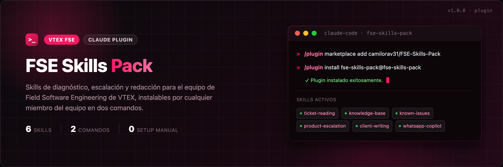

<p align="center">
  
</p>

# FSE Skills Pack

Skills para el equipo de **Field Software Engineering (FSE) de VTEX**, empaquetados como un plugin de Claude para que cualquier miembro del equipo los instale en un par de pasos, sin copiar archivos a mano. Funciona igual en **Claude Cowork** y en **Claude Code**, porque ambos leen el mismo marketplace de este repo.

## Instalación desde Claude Cowork

La mayoría del equipo usa Cowork, así que este es el camino recomendado:

1. Abre **Customize** en la barra lateral y entra a **Plugins**.
2. Selecciona **Add marketplace** y pega `camilorav31/FSE-Skills-Pack` (o la URL completa `https://github.com/camilorav31/FSE-Skills-Pack`).
3. Selecciona **Browse plugins**, busca **fse-skills-pack** y haz clic en **Install**.
4. Abre el plugin instalado para ver los 6 skills; quedan activos automáticamente y se disparan solos según el contexto de la conversación (no hace falta invocarlos por nombre).

### Actualizar (Cowork)

En **Customize → Plugins**, ubica el marketplace `fse-skills-pack` y haz clic en **Update** para traer la última versión.

### Desinstalar (Cowork)

En **Customize → Plugins**, abre el plugin `fse-skills-pack` y haz clic en **Uninstall**.

## Instalación desde Claude Code

Dentro de una sesión de Claude Code (`claude`), corre:

```
/plugin marketplace add camilorav31/FSE-Skills-Pack
/plugin install fse-skills-pack@fse-skills-pack
```

Eso es todo. Claude Code descarga el repo, instala los skills y quedan disponibles automáticamente en cualquier conversación.

### Actualizar a la última versión (Claude Code)

```
/plugin marketplace update fse-skills-pack
/plugin update fse-skills-pack@fse-skills-pack
```

### Desinstalar (Claude Code)

```
/plugin uninstall fse-skills-pack@fse-skills-pack
```

## Skills incluidos

| Skill | Para qué sirve |
|---|---|
| `vtex-fse-ticket-reading` | Analiza un ticket pegado en el chat contra documentación oficial y Slack (incidentes, deploys recientes) antes de diagnosticar o responder. |
| `vtex-fse-knowledge-base` | Decide qué es scope de FSE, a qué sub-equipo de Product Support escalar, y con qué herramienta interna validar cada caso. |
| `vtex-fse-known-issues` | Consulta el catálogo público de known issues de VTEX como validación adicional antes de escalar o responder. |
| `vtex-fse-product-escalation` | Estructura el contenido completo de un ticket de escalación a Product Support para que puedan actuar sin pedir más información. |
| `vtex-fse-client-writing` | Reglas de tono y formato para redactar la respuesta final a un cliente o el mensaje de escalation a producto. |
| `fse-whatsapp-copilot` | Explica el Copilot interno de WhatsApp del equipo y genera la instrucción para consultarlo/operarlo durante el diagnóstico de un ticket. |

## Seguridad y mantenimiento

- Este repo es **público**, pero no contiene datos de clientes, credenciales ni URLs internas: solo reglas de proceso y redacción. Antes de agregar un skill nuevo o editar uno existente, revisa que no incluya datos sensibles de una cuenta real.
- Para editar un skill: modifica su `SKILL.md` en `plugins/fse-skills-pack/skills/<skill>/`, sube el cambio con un mensaje claro y, si aplica, sube el número de `version` en `plugins/fse-skills-pack/.claude-plugin/plugin.json`.

## Estructura del repo

```
.claude-plugin/marketplace.json      # catálogo del marketplace (lo que agrega /plugin marketplace add)
plugins/fse-skills-pack/
  .claude-plugin/plugin.json         # manifiesto del plugin
  skills/<nombre-del-skill>/SKILL.md # cada skill
```
